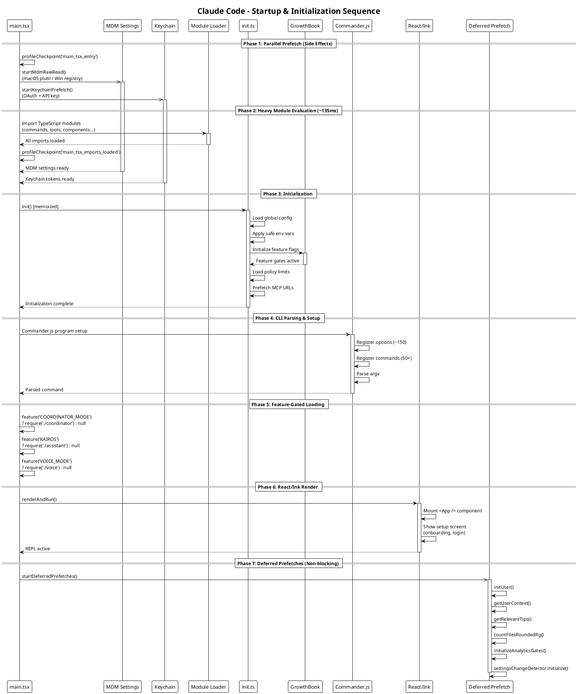

# 02 启动与初始化流程

## 架构图



## 启动全流程

Claude Code 的启动经过 7 个阶段，核心设计目标是**最小化首次交互延迟**。

### Phase 1: 并行预取 (Side Effects)

在 `main.tsx` 的最前几行，**在任何模块导入之前**，启动两个并行 I/O 操作：

```typescript
// main.tsx line 12
profileCheckpoint('main_tsx_entry')

// main.tsx line 16 - 并行: MDM 子进程
startMdmRawRead()
// macOS: plutil -convert json /Library/Managed\ Preferences/com.anthropic.claudecode.plist
// Windows: reg query HKLM\SOFTWARE\Policies\ClaudeCode

// main.tsx line 20 - 并行: Keychain 读取
startKeychainPrefetch()
// 读取 OAuth token + legacy API key (macOS Keychain / credential store)
```

**设计原理**: TypeScript 模块的导入评估需要 ~135ms。这段时间内 CPU 主要在解析 AST，I/O 通道空闲。将 MDM 和 Keychain 的读取提前到导入之前，利用这段空闲的 I/O 时间并行完成，最终启动时间取决于 `max(导入时间, I/O 时间)` 而非两者之和。

### Phase 2: 模块评估 (~135ms)

```typescript
// main.tsx line 209
profileCheckpoint('main_tsx_imports_loaded')
```

在此阶段，所有 TypeScript 模块完成导入和评估。包括：
- 命令注册表 (`commands.ts`)
- 工具注册表 (`tools.ts`)
- 组件库 (`components/`)
- 服务模块 (`services/`)

### Phase 3: 初始化 (init)

```typescript
// entrypoints/init.ts
export const init = memoize(async (): Promise<void> => {
  // 1. 加载全局配置
  // 2. 应用安全环境变量
  // 3. 初始化 GrowthBook Feature Flags
  // 4. 加载组织策略限制
  // 5. 预取 MCP URLs
  // 6. 后台清理过期插件
  // 7. 初始化遥测
})
```

`init()` 使用 `memoize` 确保只执行一次。多次调用返回同一个 Promise。

### Phase 4: CLI 解析

```typescript
// Commander.js 设置
async function run(): Promise<CommanderCommand> {
  const program = new CommanderCommand()
    .configureHelp(createSortedHelpConfig())
    .enablePositionalOptions()

  program.name('claude')
    .description('Claude Code - starts an interactive session by default...')
    .argument('[prompt]', 'Your prompt', String)

  // 注册 ~150 个选项
  program.option('-w, --worktree [name]', '...')
  program.option('--tmux', '...')
  // ...

  // 注册命令 (commit, review, etc.)
  // ...

  return program
}
```

Commander.js 解析 argv，确定用户意图（交互式 REPL、单次 prompt、子命令等）。

### Phase 5: Feature-Gated 模块加载

使用 `bun:bundle` 的 `feature()` 函数进行**构建时死代码消除**：

```typescript
// main.tsx lines 74-82
const coordinatorModeModule = feature('COORDINATOR_MODE')
  ? require('./coordinator/coordinatorMode.js')
  : null

const assistantModule = feature('KAIROS')
  ? require('./assistant/index.js')
  : null

const kairosGate = feature('KAIROS')
  ? require('./assistant/gate.js')
  : null
```

**已知 Feature Flags**:

| Flag | 功能 | 说明 |
|------|------|------|
| `PROACTIVE` | 主动模式 | Agent 可主动执行任务 |
| `KAIROS` | 助手模式 | 后台 Agent、Brief 命令 |
| `KAIROS_BRIEF` | Brief 命令 | 简报功能 |
| `BRIDGE_MODE` | Bridge 模式 | IDE/远程桥接 |
| `DAEMON` | 守护进程 | 远程控制服务器 |
| `VOICE_MODE` | 语音模式 | 语音输入 |
| `AGENT_TRIGGERS` | Agent 触发器 | 定时调度 |
| `MONITOR_TOOL` | 监控工具 | MCP 监控 |
| `HISTORY_SNIP` | 历史裁剪 | 会话记录裁剪 |
| `COORDINATOR_MODE` | 协调器模式 | 多 Agent 协调 |
| `TRANSCRIPT_CLASSIFIER` | 转录分类器 | Auto 权限模式 |
| `BASH_CLASSIFIER` | Bash 分类器 | Bash 命令安全分类 |
| `WORKFLOW_SCRIPTS` | 工作流脚本 | 自定义工作流 |
| `CCR_REMOTE_SETUP` | 远程设置 | CCR 远程配置 |

Bun 打包器在构建时将 `feature()` 替换为字面量 `true` 或 `false`，然后进行死代码消除。外部发布版本会移除内部功能的全部代码。

### Phase 6: React/Ink 渲染

```typescript
// main.tsx
renderAndRun()
// 1. Mount <App /> 组件
// 2. 显示设置界面 (onboarding, login)
// 3. REPL 就绪
```

React + Ink 渲染器挂载应用组件树，终端 REPL 进入就绪状态。

### Phase 7: 延迟预取 (Non-blocking)

```typescript
// main.tsx lines 388-431
export function startDeferredPrefetches(): void {
  void initUser()                            // 用户身份初始化
  void getUserContext()                      // CLAUDE.md 加载
  void getRelevantTips()                     // 提示信息
  void countFilesRoundedRg(cwd, 3000)        // 文件计数 (3s 超时)
  void initializeAnalyticsGates()            // 分析门控
  void settingsChangeDetector.initialize()   // 设置变更监听
}
```

所有延迟预取均使用 `void` 启动（fire-and-forget），不阻塞 REPL 渲染。结果在后续查询时通过 `memoize` 缓存命中。

## 启动性能优化总结

| 优化策略 | 实现方式 | 节省时间 |
|---------|---------|---------|
| 并行 I/O 预取 | MDM + Keychain 在模块导入前启动 | ~135ms (与导入并行) |
| Feature Flag DCE | `bun:bundle` 构建时消除 | 减少包体积和解析时间 |
| 懒加载 | 重模块延迟 `require()` | OpenTelemetry、gRPC、分析模块按需加载 |
| 延迟预取 | 首次渲染后 fire-and-forget | 用户上下文、文件计数等不阻塞交互 |
| Memoize | 初始化函数只执行一次 | 避免重复初始化 |
| Profile Checkpoints | 10+ 检查点记录时间 | 性能问题可追踪定位 |

## 初始化流程的环境变量

| 变量 | 用途 |
|------|------|
| `CLAUDE_CODE_ENTRYPOINT` | 入口点标识 (cli/sdk/bridge) |
| `USER_TYPE` | 用户类型 ('ant' = Anthropic 内部) |
| `IS_DEMO` | 演示模式标记 |
| `ANTHROPIC_API_KEY` | API 密钥 (跳过 OAuth) |
| `ANTHROPIC_AUTH_TOKEN` | Auth Token |
| `ANTHROPIC_BASE_URL` | 自定义 API 端点 |
| `ANTHROPIC_MODEL` | 指定模型 |
| `GITHUB_ACTIONS` | CI 环境检测 |
| `GITHUB_ACTION_INPUTS` | CI 输入参数 |
