# 04 工具系统

## 架构图

```plantuml
@startuml tool-permission-flow
!theme plain
title Claude Code - Tool Permission Check Flow

start

:Tool call requested\n(toolName, input, context);

:Determine PermissionMode;
note right
  Modes:
  - default (prompt user)
  - acceptEdits (auto-accept safe ops)
  - bypassPermissions (skip all)
  - plan (show plan first)
  - auto (classifier decides)
  - bubble (delegate to parent)
  - dontAsk (silent deny)
end note

if (mode == bypassPermissions?) then (yes)
  #palegreen:ALLOW;
  stop
endif

:Check deny rules\n(policy > project > user);

if (Matches deny rule?) then (yes)
  #salmon:DENY\nwith reason;
  stop
endif

:Check allow rules\n(user > project > policy);

if (Matches allow rule?) then (yes)
  #palegreen:ALLOW;
  stop
endif

:Check filesystem permissions;
note right
  - Path safety check
  - Working directory boundaries
  - Sensitive path detection
    (.env, credentials, .git/)
  - Read vs write distinction
end note

if (Path safety fails?) then (yes)
  #salmon:DENY\n"unsafe path";
  stop
endif

if (mode == auto?) then (yes)
  :Run yoloClassifier;
  note right
    LLM-based classifier:
    - 2-stage evaluation
      (fast + thinking)
    - Reads CLAUDE.md rules
    - Builds allow/soft_deny lists
    - Returns shouldBlock + reason
  end note

  if (Classifier: shouldBlock?) then (yes)
    :Fall through to\ninteractive prompt;
  else (no)
    #palegreen:ALLOW\n(classifier approved);
    stop
  endif
endif

if (mode == acceptEdits?) then (yes)
  if (Tool is read-only\nor non-destructive?) then (yes)
    #palegreen:ALLOW;
    stop
  else (no)
    :Fall through to prompt;
  endif
endif

if (mode == dontAsk?) then (yes)
  #salmon:DENY\n(silent);
  stop
endif

if (mode == bubble?) then (yes)
  #lightyellow:BUBBLE\nto parent agent;
  stop
endif

:Run pre-permission hooks\n(settings.hooks);

if (Hook decides?) then (yes)
  if (Hook allows?) then (yes)
    #palegreen:ALLOW\n(hook);
    stop
  else (no)
    #salmon:DENY\n(hook);
    stop
  endif
else (no)
endif

#lightyellow:ASK user\nInteractive prompt;
note right
  Show:
  - Tool name & input
  - Suggested permission updates
  - Allow once / Always allow / Deny
end note

if (User response?) then (allow)
  :Persist permission update\n(if "always allow");
  #palegreen:ALLOW;
  stop
else (deny)
  :Track denial in\nDenialTrackingState;
  #salmon:DENY;
  stop
endif
@enduml
```



## 概述

工具系统是 Claude Code 的核心能力层。Claude 模型通过调用工具与外部世界交互：执行 Shell 命令、读写文件、搜索代码、调用 API 等。

系统设计了统一的 `Tool` 接口，使得内置工具、MCP 工具、Plugin 工具可以用相同方式注册、调用和管理。

## Tool 接口定义

```typescript
// src/Tool.ts

export type Tool<
  Input extends AnyObject = AnyObject,
  Output = unknown,
  P extends ToolProgressData = ToolProgressData,
> = {
  // 元数据
  name: string
  aliases?: string[]                      // 重命名后的别名
  searchHint?: string                     // ToolSearch 的关键词 (3-10 词)
  shouldDefer?: boolean                   // 延迟加载 (ToolSearch 触发后才加载)
  alwaysLoad?: boolean                    // 始终加载，不延迟
  strict?: boolean                        // 结构化输出严格模式
  maxResultSizeChars: number              // 结果最大字符数

  // MCP 元数据
  isMcp?: boolean
  mcpInfo?: { serverName: string; toolName: string }
  isLsp?: boolean

  // Schema
  readonly inputSchema: Input             // Zod Schema
  readonly inputJSONSchema?: ToolInputJSONSchema  // JSON Schema (替代 Zod)
  outputSchema?: z.ZodType<unknown>

  // 核心方法
  call(
    args: z.infer<Input>,
    context: ToolUseContext,
    canUseTool: CanUseToolFn,
    parentMessage: AssistantMessage,
    onProgress?: ToolCallProgress<P>,
  ): Promise<ToolResult<Output>>

  description(
    input: z.infer<Input>,
    options: {
      isNonInteractiveSession: boolean
      toolPermissionContext: ToolPermissionContext
      tools: Tools
    },
  ): Promise<string>                      // 动态描述 (可根据输入变化)

  // 行为谓词
  isConcurrencySafe(input: z.infer<Input>): boolean   // 是否可并发
  isEnabled(): boolean                                  // 是否启用
  isReadOnly(input: z.infer<Input>): boolean           // 是否只读
  isDestructive?(input: z.infer<Input>): boolean       // 是否破坏性
  isSearchOrReadCommand?(input: z.infer<Input>):       // 搜索/读取分类
    { isSearch: boolean; isRead: boolean; isList?: boolean }
  isOpenWorld?(input: z.infer<Input>): boolean         // 是否开放世界
  requiresUserInteraction?(): boolean                   // 是否需要用户交互
  interruptBehavior?(): 'cancel' | 'block'             // 中断行为

  // 权限与验证
  validateInput?(input: z.infer<Input>, context: ToolUseContext):
    Promise<ValidationResult>
  checkPermissions(input: z.infer<Input>, context: ToolUseContext):
    Promise<PermissionResult>
  preparePermissionMatcher?(input: z.infer<Input>):
    Promise<(pattern: string) => boolean>

  // UI 渲染
  renderToolUseMessage(input: Partial<z.infer<Input>>, options: {...}):
    React.ReactNode
  renderToolResultMessage?(content: Output, ...): React.ReactNode
  renderToolUseProgressMessage?(progressMessages: ..., ...): React.ReactNode
  renderToolUseErrorMessage?(result: ..., ...): React.ReactNode

  // 比较
  inputsEquivalent?(a: z.infer<Input>, b: z.infer<Input>): boolean
}
```

## ToolUseContext (工具执行上下文)

每次工具调用都会接收完整的执行上下文：

```typescript
export type ToolUseContext = {
  options: {
    commands: Command[]                   // 可用命令
    debug: boolean
    mainLoopModel: string                 // 当前模型
    tools: Tools                          // 所有工具
    verbose: boolean
    thinkingConfig: ThinkingConfig
    mcpClients: MCPServerConnection[]     // MCP 连接
    mcpResources: Record<string, ServerResource[]>
    isNonInteractiveSession: boolean      // 非交互模式 (CI/SDK)
    agentDefinitions: AgentDefinitionsResult
    maxBudgetUsd?: number
    customSystemPrompt?: string
    appendSystemPrompt?: string
    querySource?: QuerySource             // 查询来源
    refreshTools?: () => Tools            // MCP 连接后刷新工具
  }

  // 状态管理
  abortController: AbortController        // 取消控制
  readFileState: FileStateCache           // 文件状态缓存 (overlay)
  getAppState(): AppState                 // 读取全局状态
  setAppState(f: (prev: AppState) => AppState): void  // 更新状态
  setAppStateForTasks?: (...)             // 任务专用状态更新

  // 交互回调
  requestPrompt?: (sourceName: string, ...) => (request: PromptRequest) => Promise<PromptResponse>
  handleElicitation?: (serverName: string, params, signal) => Promise<ElicitResult>
  setToolJSX?: SetToolJSXFn              // 工具自定义 UI
  appendSystemMessage?: (msg: SystemMessage) => void
  sendOSNotification?: (opts: {...}) => void
  addNotification?: (notif: Notification) => void

  // 状态追踪
  messages: Message[]                     // 当前消息历史
  toolUseId?: string
  nestedMemoryAttachmentTriggers?: Set<string>
  loadedNestedMemoryPaths?: Set<string>
  dynamicSkillDirTriggers?: Set<string>
  discoveredSkillNames?: Set<string>

  setInProgressToolUseIDs: (f: (prev: Set<string>) => Set<string>) => void
  setHasInterruptibleToolInProgress?: (v: boolean) => void
  setResponseLength: (f: (prev: number) => number) => void

  // Agent 上下文
  agentId?: AgentId                       // 子 Agent ID
  agentType?: string
  userModified?: boolean
  preserveToolUseResults?: boolean

  // 权限相关
  localDenialTracking?: DenialTrackingState
  requireCanUseTool?: boolean
  contentReplacementState?: ContentReplacementState
  renderedSystemPrompt?: SystemPrompt     // 渲染后的系统提示
}
```

## ToolResult (工具返回)

```typescript
export type ToolResult<T> = {
  data: T                                 // 工具输出数据
  newMessages?: (UserMessage | AssistantMessage | SystemMessage)[]  // 附加消息
  contextModifier?: (context: ToolUseContext) => ToolUseContext     // 上下文修改
  mcpMeta?: { _meta?; structuredContent? }  // MCP 元数据
}
```

`contextModifier` 允许工具修改后续工具调用的上下文，例如 `EnterWorktreeTool` 修改工作目录。

## buildTool 与安全默认值

```typescript
const TOOL_DEFAULTS = {
  isEnabled: () => true,
  isConcurrencySafe: (_input?: unknown) => false,     // fail-closed: 默认不并发安全
  isReadOnly: (_input?: unknown) => false,             // fail-closed: 默认假定有写操作
  isDestructive: (_input?: unknown) => false,
  checkPermissions: (input, _ctx?) =>
    Promise.resolve({ behavior: 'allow', updatedInput: input }),
  toAutoClassifierInput: (_input?: unknown) => '',    // Auto 模式分类器输入 (空=跳过)
  userFacingName: (_input?: unknown) => '',
}

export function buildTool<D extends AnyToolDef>(def: D): BuiltTool<D> {
  return {
    ...TOOL_DEFAULTS,
    userFacingName: () => def.name,
    ...def,   // 用户定义覆盖默认值
  } as BuiltTool<D>
}
```

**fail-closed 设计**: `isConcurrencySafe` 默认返回 `false`，`isReadOnly` 默认返回 `false`。遗漏安全声明不会导致危险操作，只会导致保守行为（多余的权限提示或串行执行）。

## 内置工具分类 (40+)

### 文件操作

| 工具 | 说明 |
|------|------|
| `FileReadTool` | 文件读取（支持文本、图片、PDF、Notebook） |
| `FileWriteTool` | 文件创建/覆盖 |
| `FileEditTool` | 文件局部编辑 (old_string -> new_string) |
| `GlobTool` | 文件模式匹配 (glob patterns) |
| `NotebookEditTool` | Jupyter Notebook 编辑 |

### Shell 执行

| 工具 | 说明 |
|------|------|
| `BashTool` | Shell 命令执行 |
| `PowerShellTool` | PowerShell 执行 (Windows) |
| `REPLTool` | REPL 访问 (ANT-only) |

### 代码搜索

| 工具 | 说明 |
|------|------|
| `GrepTool` | 基于 ripgrep 的内容搜索 |
| `LSPTool` | 语言服务器协议 (hover, completions) |

### 网络

| 工具 | 说明 |
|------|------|
| `WebFetchTool` | URL 内容获取 |
| `WebSearchTool` | 网络搜索 |

### Agent 与协作

| 工具 | 说明 |
|------|------|
| `AgentTool` | 子 Agent 生成 (17 文件) |
| `SendMessageTool` | Agent 间消息传递 |
| `TeamCreateTool` | 团队创建 |
| `TeamDeleteTool` | 团队删除 |

### 任务管理

| 工具 | 说明 |
|------|------|
| `TaskCreateTool` | 创建任务 |
| `TaskGetTool` | 获取任务 |
| `TaskUpdateTool` | 更新任务 |
| `TaskListTool` | 列出任务 |
| `TaskStopTool` | 停止任务 |
| `TodoWriteTool` | TODO 列表 |

### 工作流

| 工具 | 说明 |
|------|------|
| `EnterPlanModeTool` | 进入计划模式 |
| `ExitPlanModeTool` | 退出计划模式 |
| `EnterWorktreeTool` | 进入 Git Worktree |
| `ExitWorktreeTool` | 退出 Git Worktree |
| `ScheduleCronTool` | 定时调度 |
| `RemoteTriggerTool` | 远程触发 |
| `WorkflowTool` | 工作流执行 |

### 扩展工具

| 工具 | 说明 |
|------|------|
| `MCPTool` | MCP 协议调用 |
| `SkillTool` | 技能执行 |
| `ToolSearchTool` | 延迟工具搜索 |
| `AskUserQuestionTool` | 向用户提问 |
| `SyntheticOutputTool` | 结构化输出 |
| `ConfigTool` | 配置管理 |

### Feature-Gated 工具

| 工具 | Feature Flag | 说明 |
|------|-------------|------|
| `SleepTool` | PROACTIVE | 主动模式等待 |
| `MonitorTool` | MONITOR_TOOL | MCP 监控 |
| `TungstenTool` | - | Tmux 会话管理 |

## 工具级权限模型

每个工具通过 `checkPermissions()` 方法声明所需权限。权限检查完整流程见本文档顶部的 PlantUML 图。

### PermissionResult 类型

```typescript
export type PermissionAllowDecision<Input = AnyObject> = {
  behavior: 'allow'
  updatedInput?: Input              // 可修改后的输入
  userModified?: boolean            // 用户是否修改了输入
  decisionReason?: PermissionDecisionReason
  toolUseID?: string
  acceptFeedback?: string           // 允许时的反馈
  contentBlocks?: ContentBlockParam[]
}

export type PermissionAskDecision<Input = AnyObject> = {
  behavior: 'ask'
  message: string                   // 提示消息
  updatedInput?: Input
  decisionReason?: PermissionDecisionReason
  suggestions?: PermissionUpdate[]  // 建议的权限更新
  blockedPath?: string
  pendingClassifierCheck?: PendingClassifierCheck
  contentBlocks?: ContentBlockParam[]
}

export type PermissionDenyDecision = {
  behavior: 'deny'
  message: string
  decisionReason: PermissionDecisionReason
  toolUseID?: string
}
```

### ToolPermissionContext

```typescript
export type ToolPermissionContext = DeepImmutable<{
  mode: PermissionMode                    // default/auto/bypass/plan/...
  additionalWorkingDirectories: Map<string, AdditionalWorkingDirectory>
  alwaysAllowRules: ToolPermissionRulesBySource
  alwaysDenyRules: ToolPermissionRulesBySource
  alwaysAskRules: ToolPermissionRulesBySource
  isBypassPermissionsModeAvailable: boolean
  isAutoModeAvailable?: boolean
  strippedDangerousRules?: ToolPermissionRulesBySource
  shouldAvoidPermissionPrompts?: boolean
  awaitAutomatedChecksBeforeDialog?: boolean
  prePlanMode?: PermissionMode            // 计划模式退出后恢复
}>
```

## 工具延迟加载 (Deferred Tools)

为减少 API 请求中的工具 Schema 体积，部分低频工具标记为 `shouldDefer: true`：

- 延迟工具在初始请求中只发送名称和 `searchHint`
- 当 Claude 需要使用时，通过 `ToolSearchTool` 搜索并加载完整 Schema
- `alwaysLoad: true` 的工具始终包含在请求中

这种设计在工具数量超过 40 个时有效减少了 Token 消耗。

## 进度追踪

```typescript
export type ToolProgressData = {
  // 基础进度数据（各工具可扩展）
}

export type ToolCallProgress<P extends ToolProgressData> = (
  progress: ProgressMessage<P>
) => void
```

工具通过 `onProgress` 回调报告执行进度，UI 层实时渲染进度条和状态文本（如 Bash 命令的输出流、文件搜索的匹配计数等）。
