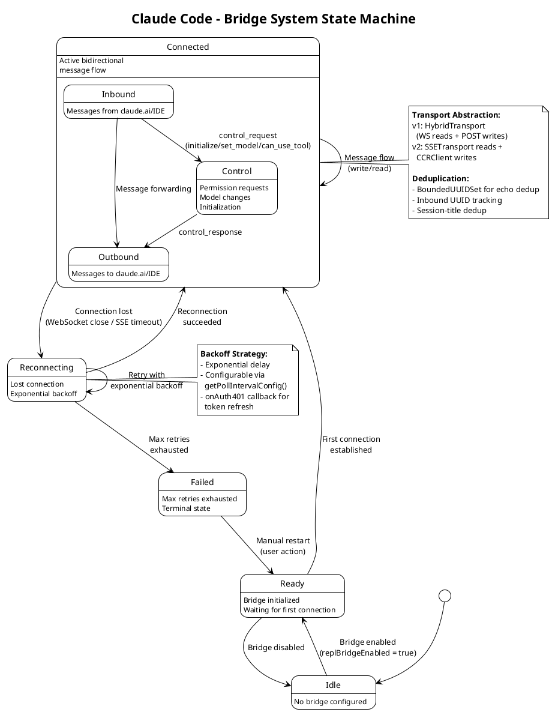

# 07 Bridge 系统 (IDE/远程桥接)

## 架构图



## 概述

Bridge 系统是 Claude Code 与外部环境（claude.ai 网页端、VS Code、JetBrains IDE）之间的双向通信层。它使 Claude Code 能够作为"always-on"后端运行，接收来自浏览器或 IDE 的消息，并将结果回传。

## 核心类型

### ReplBridgeHandle

```typescript
export type ReplBridgeHandle = {
  bridgeSessionId: string
  environmentId: string
  sessionIngressUrl: string
  writeMessages(messages: Message[]): void
  writeSdkMessages(messages: SDKMessage[]): void
  sendControlRequest(request: SDKControlRequest): void
  sendControlResponse(response: SDKControlResponse): void
  sendControlCancelRequest(requestId: string): void
  sendResult(): void
  teardown(): Promise<void>
}
```

### Bridge 状态机

```
Idle -> Ready -> Connected <-> Reconnecting -> Failed
                     |                            |
                     +------- Message Flow --------+
                                                   |
                                            Manual Restart -> Ready
```

| 状态 | 说明 |
|------|------|
| `Idle` | Bridge 未配置 |
| `Ready` | Bridge 已初始化，等待首次连接 |
| `Connected` | 活跃双向消息流 |
| `Reconnecting` | 连接断开，指数退避重试 |
| `Failed` | 超过最大重试次数，终态 |

## 通信协议

### Work-Lease 模型

Bridge 使用轮询模式获取工作：

```typescript
export type WorkResponse = {
  id: string                        // Work item UUID
  type: 'work'
  environment_id: string
  state: string
  data: WorkData                    // { type: 'session' | 'healthcheck', id: string }
  secret: string                    // base64url 编码的 JSON (含 token)
  created_at: string
}

// secret 解密后的负载
export type WorkSecret = {
  version: number
  session_ingress_token: string     // JWT 用于 WS/SSE 认证
  api_base_url: string
  sources: Array<{ type: string; git_info?: {...} }>
  auth: Array<{ type: string; token: string }>
  use_code_sessions?: boolean       // CCR v2 标记
}
```

### 传输抽象

```typescript
export type ReplBridgeTransport = {
  // 消息 I/O
  write(message: StdoutMessage): Promise<void>
  writeBatch(messages: StdoutMessage[]): Promise<void>

  // 生命周期
  connect(): void
  close(): void
  isConnectedStatus(): boolean
  getStateLabel(): string

  // 事件处理
  setOnData(callback: (data: string) => void): void
  setOnClose(callback: (closeCode?: number) => void): void
  setOnConnect(callback: () => void): void

  // 协议特定
  getLastSequenceNum(): number          // SSE 序号用于历史重放
  reportState(state: SessionState): void  // v2 only
  reportDelivery(eventId: string, status: 'processing' | 'processed'): void
  flush(): Promise<void>               // v2 only
}
```

### v1 vs v2 实现

| 特性 | v1 (HybridTransport) | v2 (SSETransport + CCRClient) |
|------|----------------------|-------------------------------|
| 读取 | WebSocket | SSE (Server-Sent Events) |
| 写入 | HTTP POST | CCR v2 /worker/* endpoints |
| 历史重放 | 不支持 | SSE 序号重放 |
| 状态报告 | 不支持 | `reportState()` |
| 投递确认 | 不支持 | `reportDelivery()` |
| 刷新 | 立即 resolve | `flush()` 等待投递 |

## BridgeCoreParams (依赖注入)

```typescript
export type BridgeCoreParams = {
  dir: string
  machineName: string
  branch: string
  gitRepoUrl: string | null
  title: string
  baseUrl: string
  sessionIngressUrl: string

  // 注入回调 (IDE/daemon 不导入命令注册表)
  getAccessToken: () => string | undefined
  createSession: (opts: {
    environmentId: string; title: string; gitRepoUrl: string | null;
    branch: string; signal: AbortSignal
  }) => Promise<string | null>
  archiveSession: (sessionId: string) => Promise<void>
  onAuth401?: (staleToken: string) => Promise<boolean>
  getPollIntervalConfig?: () => PollIntervalConfig

  // 可选回调
  onInboundMessage?: (msg: SDKMessage) => void
  onPermissionResponse?: (response: SDKControlResponse) => void
  onStateChange?: (state: BridgeState, detail?: string) => void
}
```

**设计决策**: 使用依赖注入而非直接导入，使 Bridge 核心可以在不同环境（CLI REPL、IDE 插件、Daemon）中复用，无需导入庞大的命令注册表。

## 消息路由

```typescript
// src/bridge/bridgeMessaging.ts

export function handleIngressMessage(
  data: string,
  recentPostedUUIDs: BoundedUUIDSet,      // 回显去重
  recentInboundUUIDs: BoundedUUIDSet,      // 重投递去重
  onInboundMessage?: (msg: SDKMessage) => void,
  onPermissionResponse?: (response: SDKControlResponse) => void,
  onControlRequest?: (request: SDKControlRequest) => void,
): void
```

路由规则：
1. **control_response** -> 权限回调 (onPermissionResponse)
2. **control_request** -> 子类型: `initialize` | `set_model` | `can_use_tool`
3. **SDKMessage** (user/assistant/progress) -> 入站消息处理 (onInboundMessage)

## 去重机制

Bridge 使用 `BoundedUUIDSet` 进行消息去重：

- **回显去重**: 追踪最近发送的 UUID，过滤自己发送后被服务端回传的消息
- **入站去重**: 追踪最近收到的 UUID，过滤传输层切换后的重投递
- **会话标题去重**: 防止重复的会话标题更新

## 核心文件

| 文件 | 大小 | 说明 |
|------|------|------|
| `bridge/bridgeMain.ts` | 115KB | Bridge 主循环、Work-Lease、生命周期 |
| `bridge/replBridge.ts` | 100KB | REPL 会话桥接 |
| `bridge/bridgeMessaging.ts` | - | 消息协议与路由 |
| `bridge/sessionRunner.ts` | - | 会话执行器 |
| `bridge/jwtUtils.ts` | - | JWT 认证 |
| `bridge/remoteBridgeCore.ts` | - | 远程 Bridge 核心 |
