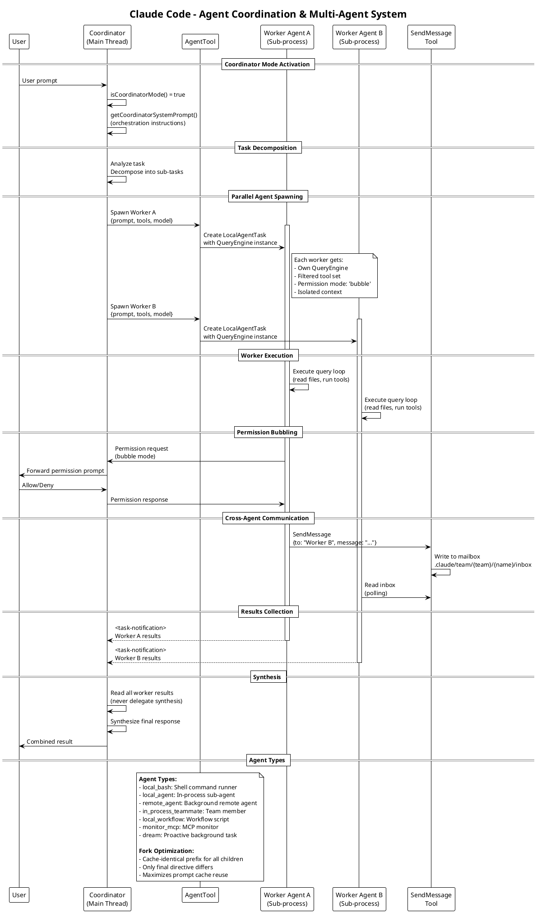

# 09 Agent 协调与多智能体

## 架构图



## 概述

Claude Code 支持多 Agent 协作，通过 `AgentTool` 生成子 Agent，通过 `Coordinator` 模式协调多个 Agent 并行工作。Agent 间通过邮箱系统 (`SendMessage`) 通信。

## Agent 类型

```typescript
type TaskType =
  | 'local_bash'            // Shell 命令运行器
  | 'local_agent'           // 进程内子 Agent
  | 'remote_agent'          // 后台远程 Agent
  | 'in_process_teammate'   // 团队成员
  | 'local_workflow'        // 工作流脚本
  | 'monitor_mcp'           // MCP 监控
  | 'dream'                 // 主动后台任务

type TaskStatus = 'pending' | 'running' | 'completed' | 'failed' | 'killed'
```

## Agent 生成 (AgentTool)

### Fork 子 Agent

Fork 是 Agent 生成的优化路径，核心优势是**Prompt Cache 共享**：

```typescript
export function isForkSubagentEnabled(): boolean {
  // Feature gate + coordinator mode guard + interactive-only
}

// Fork Agent 定义
export const FORK_AGENT = {
  agentType: 'fork',
  tools: ['*'],                   // 继承父 Agent 的完整工具集
  maxTurns: 200,
  model: 'inherit',
  permissionMode: 'bubble',       // 权限请求冒泡到父 Agent
  getSystemPrompt: () => '',      // 未使用; fork 传递渲染后的字节
}
```

### Fork 消息构造

```typescript
export function buildForkedMessages(
  directive: string,
  assistantMessage: AssistantMessage,
): MessageType[]
```

**Cache 优化策略**:
- 所有 fork 子 Agent 共享父 Agent 渲染后的系统提示字节
- 工具定义和历史消息在所有 fork 中完全一致
- 只有最后的 directive（指令文本）不同
- 这最大化了 Prompt Cache 前缀复用

### 检测 Fork 子 Agent (防止递归)

```typescript
export function isInForkChild(messages: MessageType[]): boolean {
  return messages.some(m =>
    m.type === 'user' &&
    m.message.content.some(block =>
      block.type === 'text' &&
      block.text.includes(`<${FORK_BOILERPLATE_TAG}>`)
    )
  )
}
```

## 工具过滤与解析

```typescript
export function resolveAgentTools(
  agentDefinition: Pick<AgentDefinition, 'tools' | 'disallowedTools' | 'source' | 'permissionMode'>,
  availableTools: Tools,
  isAsync?: boolean,
  isMainThread?: boolean,
): ResolvedAgentTools {
  // 返回:
  // {
  //   hasWildcard: boolean          // tools = ['*'] 或 undefined
  //   validTools: string[]          // 有效工具名
  //   invalidTools: string[]        // 请求但不可用的工具
  //   resolvedTools: Tools          // 过滤后的工具集
  //   allowedAgentTypes?: string[]  // Agent 工具约束
  // }
}
```

### 工具过滤规则

```typescript
export function filterToolsForAgent({
  tools: Tools,
  isBuiltIn: boolean,
  isAsync?: boolean,
  permissionMode?: PermissionMode,
}): Tools
```

过滤规则：
- **始终允许**: MCP 工具 (前缀 `mcp__`)
- **始终禁止**: `ALL_AGENT_DISALLOWED_TOOLS` (SendMessage, TeamCreate 等)
- **自定义 Agent 禁止**: `CUSTOM_AGENT_DISALLOWED_TOOLS` (非内置 Agent)
- **异步 Agent 限制**: `ASYNC_AGENT_ALLOWED_TOOLS` (除非是进程内队友)

## Coordinator 模式

当启用 `COORDINATOR_MODE` Feature Flag 时，主 Agent 转变为协调器：

```typescript
export function isCoordinatorMode(): boolean {
  return feature('COORDINATOR_MODE') &&
         isEnvTruthy(process.env.CLAUDE_CODE_COORDINATOR_MODE)
}
```

### 协调器系统提示

```typescript
export function getCoordinatorSystemPrompt(): string {
  // 返回完整的协调器角色系统提示:
  // - 通过 AgentTool 生成 Worker
  // - 通过 SendMessage 协调
  // - 任务编排 (并行 Worker, 综合)
  // - Worker 结果通过 <task-notification> XML 到达
  // - 协调器永远不委托综合工作 -- 读取发现，规划下一步
}
```

### 协调器上下文

```typescript
export function getCoordinatorUserContext(
  mcpClients: ReadonlyArray<{ name: string }>,
  scratchpadDir?: string,
): { [k: string]: string } {
  // 返回:
  // - 生成的 Worker 可用的工具列表
  // - 可用的 MCP 服务器
  // - Scratchpad 目录 (跨 Worker 持久化状态)
}
```

**设计原则**: 协调器**永远不委托综合工作**。所有 Worker 的结果由协调器读取和整合，确保最终输出的一致性和质量。

## Agent 间通信 (SendMessage)

### 类型定义

```typescript
export type Input = {
  to: string                    // 目标: 队友名称 | '*' 广播 | 'uds:<path>' | 'bridge:<session-id>'
  summary?: string              // 5-10 字预览
  message: string | StructuredMessage
}

export type MessageOutput = {
  success: boolean
  message: string
  routing?: {
    sender: string
    senderColor?: string
    target: string
    targetColor?: string
    summary?: string
    content?: string
  }
}

// 结构化消息 (非字符串负载)
type StructuredMessage =
  | { type: 'shutdown_request'; reason?: string }
  | { type: 'shutdown_response'; request_id: string; approve: boolean; reason?: string }
  | { type: 'plan_approval_response'; request_id: string; approve: boolean; feedback?: string }
```

### 邮箱系统

消息通过文件系统邮箱传递：

```
.claude/team/{teamName}/{recipientName}/inbox
```

- 发送者异步写入
- 接收者轮询读取
- 使用 `readTeamFileAsync()` / `writeTeamFileAsync()`

## 权限冒泡

子 Agent 的权限模式通常设置为 `bubble`：

- 当子 Agent 需要权限时，请求冒泡到父 Agent
- 父 Agent 转发给用户进行交互式确认
- 用户的决定回传给子 Agent

这避免了多个 Agent 同时向用户提示权限的混乱场景。

## Agent 协作流程

1. **任务分解**: 协调器分析用户请求，分解为独立子任务
2. **并行生成**: 通过 `AgentTool` 并行生成多个 Worker Agent
3. **独立执行**: 每个 Worker 拥有独立的 QueryEngine、工具集和上下文
4. **权限冒泡**: Worker 的权限请求冒泡到协调器，再转发给用户
5. **跨 Agent 通信**: Worker 间通过 `SendMessage` + 邮箱系统通信
6. **结果收集**: Worker 完成后通过 `<task-notification>` XML 返回结果
7. **综合输出**: 协调器读取所有结果，综合生成最终响应

## 核心文件

| 文件 | 说明 |
|------|------|
| `tools/AgentTool/` | Agent 工具实现 (17 文件) |
| `tools/AgentTool/agentToolUtils.ts` | 工具过滤与解析 |
| `coordinator/coordinatorMode.ts` | 协调器模式 |
| `tools/SendMessageTool/` | Agent 间消息传递 |
| `tools/TeamCreateTool/` | 团队创建 |
| `tools/TeamDeleteTool/` | 团队删除 |
| `tasks/` | 任务系统 (12 文件) |
