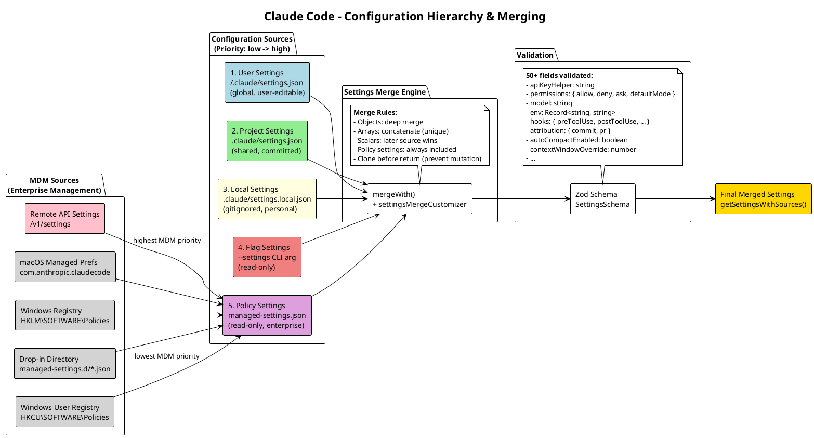

# 10 配置系统与权限体系

## 架构图



## 一、配置系统

### 配置源层级

配置从多个来源加载，按优先级合并。后来源覆盖先来源：

```typescript
export const SETTING_SOURCES = [
  'userSettings',        // 1. ~/.claude/settings.json (全局, 用户可编辑)
  'projectSettings',     // 2. .claude/settings.json (项目级, 可提交)
  'localSettings',       // 3. .claude/settings.local.json (gitignored, 个人)
  'flagSettings',        // 4. --settings CLI 参数 (只读)
  'policySettings',      // 5. managed-settings.json (只读, 企业策略)
] as const

export type SettingSource = (typeof SETTING_SOURCES)[number]
export type EditableSettingSource = Exclude<SettingSource, 'policySettings' | 'flagSettings'>
```

### Settings Schema (Zod)

```typescript
export const SettingsSchema = lazySchema(() =>
  z.object({
    $schema: z.literal(CLAUDE_CODE_SETTINGS_SCHEMA_URL).optional(),

    // 凭证
    apiKeyHelper: z.string().optional(),
    awsCredentialExport: z.string().optional(),
    awsAuthRefresh: z.string().optional(),
    gcpAuthRefresh: z.string().optional(),
    xaaIdp: z.object({
      issuer: z.string().url(),
      clientId: z.string(),
      callbackPort: z.number().int().positive().optional(),
    }).optional(),

    // 文件处理
    fileSuggestion: z.object({
      type: z.literal('command'),
      command: z.string(),
    }).optional(),
    respectGitignore: z.boolean().optional(),
    cleanupPeriodDays: z.number().nonnegative().int().optional(),

    // 环境变量
    env: z.record(z.string(), z.coerce.string()).optional(),

    // 归因
    attribution: z.object({
      commit: z.string().optional(),
      pr: z.string().optional(),
    }).optional(),

    // 权限
    permissions: z.object({
      allow: z.array(PermissionRuleSchema()).optional(),
      deny: z.array(PermissionRuleSchema()).optional(),
      ask: z.array(PermissionRuleSchema()).optional(),
      defaultMode: z.enum(PERMISSION_MODES).optional(),
      disableBypassPermissionsMode: z.enum(['disable']).optional(),
      disableAutoMode: z.enum(['disable']).optional(),
      additionalDirectories: z.array(z.string()).optional(),
    }).passthrough().optional(),

    // 模型与行为
    model: z.string().optional(),
    effortLevel: z.enum(['low', 'medium', 'high', ...]).optional(),
    alwaysThinkingEnabled: z.boolean().optional(),
    fastMode: z.boolean().optional(),

    // 上下文与压缩
    autoCompactEnabled: z.boolean().optional(),
    contextWindowOverride: z.number().int().optional(),

    // Hooks 与扩展
    hooks: z.object({ /* preToolUse, postToolUse, ... */ }).optional(),
    pluginConfigs: z.record(z.string(), z.object({ /* ... */ })).optional(),

    // ... 50+ 更多字段
  })
  .passthrough()  // 允许未知键 (前向兼容)
)
```

使用 `lazySchema()` 延迟初始化，避免循环导入。`.passthrough()` 允许未知字段，确保旧版本客户端不会因新字段报错。

### 设置加载与合并

```typescript
// src/utils/settings/settings.ts

export function loadManagedFileSettings(): {
  settings: SettingsJson | null
  errors: ValidationError[]
}
// 合并 managed-settings.json + drop-ins/ (按字母排序)

export function parseSettingsFile(path: string): {
  settings: SettingsJson | null
  errors: ValidationError[]
}
// 带缓存的解析, Zod 验证

export function getSettingsForSource(source: SettingSource): SettingsJson
// 加载并缓存特定来源的设置

export function getSettingsWithSources(): SettingsWithSources
// 返回所有来源合并后的设置

export function updateSettingsForSource(
  source: EditableSettingSource,
  settings: SettingsJson,
  shouldBackup?: boolean,
): void
// 写回磁盘
```

### 合并策略

```typescript
export function settingsMergeCustomizer(
  objValue?: unknown,
  srcValue?: unknown,
): unknown

// 合并规则:
// - 对象: 深度合并
// - 数组: 拼接 (去重)
// - 标量: 后来源覆盖
// - 策略设置: 始终包含
// - 返回前克隆 (防止突变)
```

### MDM 企业管理

```typescript
export function startMdmSettingsLoad(): void
export async function ensureMdmSettingsLoaded(): Promise<void>
export function getMdmSettings(): MdmResult
export function getHkcuSettings(): MdmResult
export function clearMdmSettingsCache(): void

type MdmResult = { settings: SettingsJson; errors: ValidationError[] }
```

**MDM 优先级** (从高到低):

| 优先级 | 来源 | 说明 |
|--------|------|------|
| 1 | Remote API Settings | `/v1/settings` API |
| 2 | macOS Managed Prefs | `com.anthropic.claudecode` 偏好域 (plist) |
| 3 | Windows HKLM Registry | `HKLM\SOFTWARE\Policies\ClaudeCode` (管理员) |
| 4 | Drop-in Directory | `managed-settings.d/*.json` (按字母排序) |
| 5 | managed-settings.json | 主管理配置文件 |
| 6 | Windows HKCU Registry | `HKCU\SOFTWARE\Policies\ClaudeCode` (用户) |

**平台支持**:
- **macOS**: `plutil -convert json` 读取偏好域
- **Windows**: `reg query` 读取注册表
- **Linux**: `/etc/claude-code/managed-settings.json` + drop-ins

### 配置迁移

```typescript
// src/migrations/
migrateOpusToOpus1m.ts           // Opus -> Opus 1M
migrateSonnet45ToSonnet46.ts     // Sonnet 4.5 -> Sonnet 4.6
// ... 更多模型/设置迁移
```

配置迁移在启动时自动执行，处理模型重命名、权限模式变更等。

## 二、权限体系

### 权限模式

```typescript
export const EXTERNAL_PERMISSION_MODES = [
  'acceptEdits',          // 自动接受非危险操作
  'bypassPermissions',    // 跳过所有权限检查
  'default',              // 标准模式, 需要用户确认
  'dontAsk',              // 静默拒绝
  'plan',                 // 先展示计划再执行
] as const

export type InternalPermissionMode =
  | ExternalPermissionMode
  | 'auto'                // LLM 分类器决策 (需 TRANSCRIPT_CLASSIFIER flag)
  | 'bubble'              // 委托给父 Agent
```

### 权限规则

```typescript
export type PermissionBehavior = 'allow' | 'deny' | 'ask'

export type PermissionRuleValue = {
  toolName: string
  ruleContent?: string        // 可选的内容匹配规则
}

export type PermissionRule = {
  source: PermissionRuleSource
  ruleBehavior: PermissionBehavior
  ruleValue: PermissionRuleValue
}

export type PermissionRuleSource =
  | 'userSettings'
  | 'projectSettings'
  | 'localSettings'
  | 'flagSettings'
  | 'policySettings'
  | 'cliArg'
  | 'command'
  | 'session'
```

### 权限检查流程

详细流程见 [04-core-tool-system](04-core-tool-system.md) 中的权限检查 PlantUML 图。简要概述：

1. **检查权限模式**: `bypassPermissions` 直接放行
2. **检查 deny 规则**: policy > project > user 优先级
3. **检查 allow 规则**: user > project > policy 优先级
4. **文件系统安全检查**: 路径安全、工作目录边界、敏感路径检测
5. **Auto 模式**: 运行 yoloClassifier (LLM 分类器)
6. **acceptEdits 模式**: 非危险操作自动放行
7. **dontAsk 模式**: 静默拒绝
8. **bubble 模式**: 冒泡到父 Agent
9. **Pre-permission hooks**: settings.hooks 预检
10. **交互式提示**: 向用户展示操作详情，等待确认

### 文件系统权限

```typescript
export function checkReadPermissionForTool(
  tool: Tool,
  input: { [key: string]: unknown },
  toolPermissionContext: ToolPermissionContext,
): PermissionDecision

export function checkWritePermissionForTool<Input extends AnyObject>(
  tool: Tool<Input>,
  input: z.infer<Input>,
  toolPermissionContext: ToolPermissionContext,
  precomputedPathsToCheck?: readonly string[],
): PermissionDecision
```

检查内容：
- 路径安全 (拒绝可疑模式)
- 工作目录边界
- 敏感路径检测 (`.env`, credentials, `.git/`)
- 读写权限区分
- 编辑权限隐含读取权限

### yoloClassifier (Auto 模式)

```typescript
export type AutoModeRules = {
  allow: string[]           // 允许规则列表
  soft_deny: string[]       // 软拒绝规则列表
  environment: string[]     // 环境规则
}

export type YoloClassifierResult = {
  thinking?: string
  shouldBlock: boolean
  reason: string
  unavailable?: boolean
  transcriptTooLong?: boolean
  model: string
  usage?: ClassifierUsage
  durationMs?: number
  stage?: 'fast' | 'thinking'
  // ... 更多诊断字段
}
```

**yoloClassifier 特点**:
- LLM 驱动的权限分类器
- 2 阶段评估：fast 阶段 + thinking 阶段 (XML 路径)
- 读取 CLAUDE.md 规则推断用户意图
- 转录超过上下文窗口时回退到交互式提示
- 记录 Token 用量和请求 ID 用于分析
- 转储错误提示和请求/响应体用于调试
- 需要 `TRANSCRIPT_CLASSIFIER` Feature Flag

### 权限决策原因追踪

```typescript
type PermissionDecisionReason =
  | { type: 'rule'; rule: PermissionRule }
  | { type: 'mode'; mode: PermissionMode }
  | { type: 'hook'; hookName: string }
  | { type: 'classifier'; classifier: string; reason: string }
  | { type: 'workingDir'; reason: string }
  | { type: 'safetyCheck'; reason: string; classifierApprovable: boolean }
  // ... 更多类型用于诊断和审计
```

### 权限处理器

三种处理器实现，对应不同执行环境：

| 处理器 | 环境 | 说明 |
|--------|------|------|
| `coordinatorHandler` | 主线程 | 协调器模式下的权限处理 |
| `interactiveHandler` | REPL/交互 | 终端交互式权限确认 |
| `swarmWorkerHandler` | 子 Agent | Worker 的权限冒泡 |

### 权限上下文

```typescript
type PermissionQueueOps = {
  push(item: ToolUseConfirm): void
  remove(toolUseID: string): void
  update(toolUseID: string, patch: Partial<ToolUseConfirm>): void
}

export type PermissionContext = {
  tool: ToolType
  input: Record<string, unknown>
  toolUseContext: ToolUseContext
  assistantMessage: AssistantMessage
  messageId: string
  toolUseID: string

  // 方法
  async tryClassifier(...): Promise<PermissionDecision | null>
  async runHooks(...): Promise<PermissionDecision | null>
  async handleUserAllow(...): Promise<PermissionAllowDecision>
  async handleHookAllow(...): Promise<PermissionAllowDecision>

  buildAllow(updatedInput, opts?): PermissionAllowDecision
  buildDeny(message, reason): PermissionDenyDecision

  async persistPermissions(updates: PermissionUpdate[]): Promise<boolean>
  pushToQueue(item: ToolUseConfirm): void
}
```

## 核心文件

### 配置系统

| 文件 | 说明 |
|------|------|
| `utils/config.ts` (63KB) | 全局配置管理 |
| `utils/settings/settings.ts` | 设置加载与合并 |
| `utils/settings/types.ts` | Zod Schema 定义 |
| `utils/settings/constants.ts` | 常量定义 |
| `utils/settings/mdm/settings.ts` | MDM 企业管理 |
| `schemas/` | 配置 Schema |
| `migrations/` (11 文件) | 配置迁移 |

### 权限系统

| 文件 | 说明 |
|------|------|
| `utils/permissions/permissions.ts` | 权限规则评估 |
| `utils/permissions/filesystem.ts` | 文件系统权限 |
| `utils/permissions/yoloClassifier.ts` | Auto 模式分类器 |
| `hooks/toolPermission/PermissionContext.ts` | 权限上下文 |
| `hooks/toolPermission/coordinatorHandler` | 协调器处理器 |
| `hooks/toolPermission/interactiveHandler` | 交互式处理器 |
| `hooks/toolPermission/swarmWorkerHandler` | Worker 处理器 |
| `types/permissions.ts` | 类型定义 |
